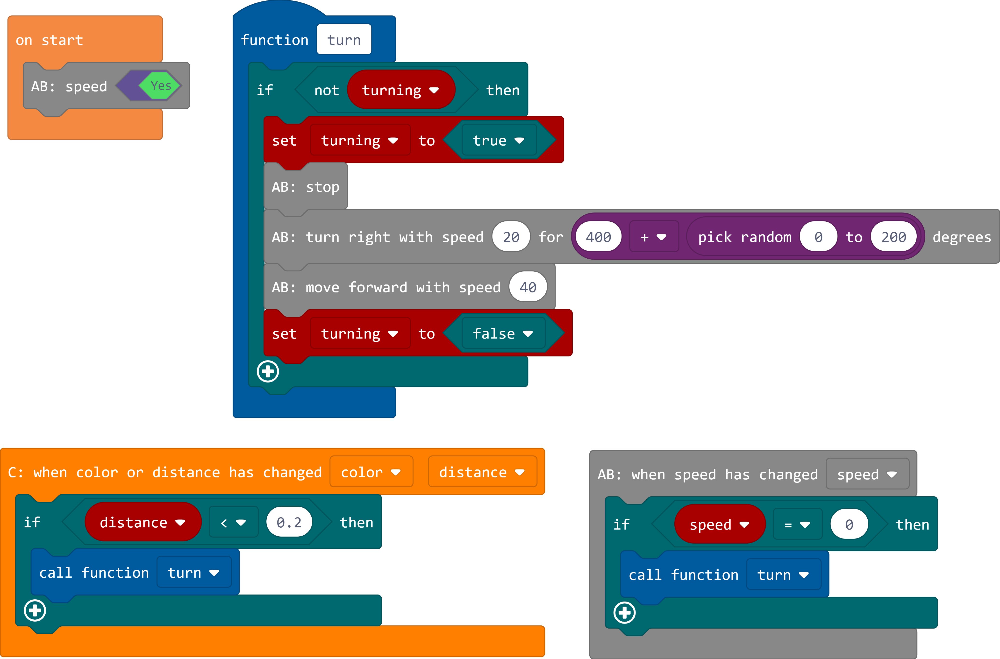

# Move Hub IDE #

*pxt-movehub* is a programming environment for [LEGO® Boost](https://www.lego.com/themes/boost) on Windows 10, based on [Microsoft MakeCode](https://github.com/Microsoft/pxt). It's meant for teaching beginners in programming fundamentals.

## Features ##

- Motor (constant, timed and angled)
- Rotation notifications (angle and speed)
- Color and distance sensor notifications (color/distance and luminosity)
- LED
- Button notifications (pressed and released)
- Tilt sensor notifications (3 axis simple and precise)

## [Example](examples/vernie.js) ##

## How to run ##

First you have to install some build tools for compiling the native dependencies of this project:

    npm --vs2015 install --global windows-build-tools

Additionally, the Windows 10 SDK (Version 10.0.15063) must be present. Download it from [here](https://go.microsoft.com/fwlink/p/?LinkId=845298) and install it.

Install now all dependencies using [Yarn](https://yarnpkg.com/). Simply execute `yarn` in the project root folder.

For rebuilding the native components for [Electron](https://electronjs.org/) execute this command:

    npm rebuild --runtime=electron --target=3.0.3 --arch=x64 --rebuild --disturl=https://atom.io/download/electron --build_from_source=true --msvs_version=2015

Now you can start the application by running `yarn start`. Rebuilding for Electron must be repeated when updating the dependencies with Yarn.
